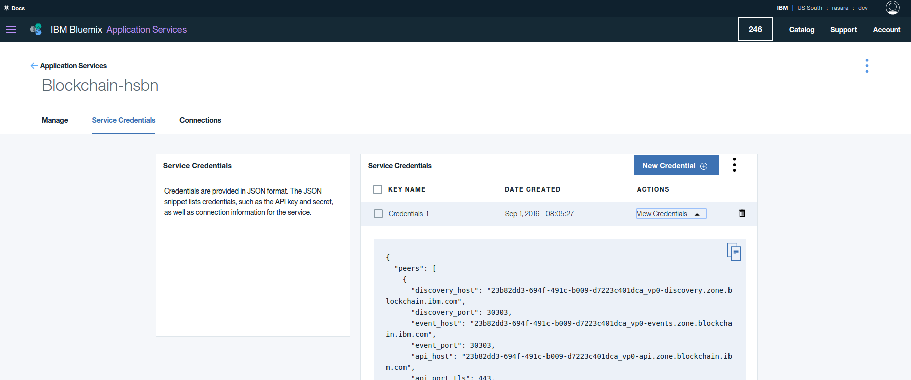

#Diploma Supplement Service


This is a Hyperledger backed up service that allows the users to publish, and control who has access on their
Diploma Supplements

**This Service builds on top of the SDK-Demo project by IBM. For more information read below**


#How to use hfc with the IBM Bluemix Blockchain beta service

The goal is to run [helloblockchain.js](https://github.com/ratnakar-asara/Node-Sample/blob/master/helloblockchain.js) sample program, which will deploy example02 chaincode and query/invoke it.

1. Install npm if not installed already, instructions are [here](http://blog.npmjs.org/post/85484771375/how-to-install-npm)

1. clone this repository
   ```
   git clone https://github.com/IBM-Blockchain/SDK-Demo.git
   ```

1. Go to **SDK-Demo** folder and install hfc package with the below command:

	```
	npm install
	```

1. Create a Bluemix account, login and using the Catlog and select the Blockchain service.  Once in the service select either a `Starter Developer plan` or `High Security Business Network plan` (if authorized).  Now, click on `CREATE` and get the `Service Credentials` for the service.   Cut and Paste this json file and save it  as ServiceCredentials.json  in your local directory where [helloblockchain.js](https://github.com/IBM-Blockchain/SDK-Demo/blob/master/helloblockchain.js)
	- Refer the sample file in repo [here](https://github.com/IBM-Blockchain/SDK-Demo/blob/master/ServiceCredentials.json)

     

1.  The node sdk will create the keyValStore directory and store cryptography data for each user that registers.
    ```
    WARNING: Once enrollment is successful you will see the crypto material under keyValStore-<network-id>
             Don't delete this material till your network is deleted or reset.
	     If you lost this cryptography data you can't communicate with Bluemix CA server, thus enrollment fails
    ```

1. From SDK-Demo folder run node program:
	```
	node helloblockchain.js
	```
	**To enable debug logs :**
	```
	DEBUG=hfc node helloblockchain.js
	```

	**To enable grpc traces:**
	```
	GRPC_TRACE=all DEBUG=hfc node helloblockchain.js
	```

Once Deploy/Invoke and Query are successful, we should see the below messages:

```
Successfully deployed chaincode: request={"fcn":"init","args":["a","100","b","200"],"certificatePath":"/certs/blockchain-cert.pem","chaincodePath":"chaincode_example02"}, response={"uuid":"2d6ad8d6-1390-4c60-a01b-f4c301175eb7","chaincodeID":"9be0a0ed3f1788e8728c8911c747d2f6d0e205fa63422dc598d498fe709b9b8d","result":"TODO: get actual results; waited 120 seconds and assumed deploy was successful"}

Successfully submitted chaincode invoke transaction: request={"chaincodeID":"9be0a0ed3f1788e8728c8911c747d2f6d0e205fa63422dc598d498fe709b9b8d","fcn":"invoke","args":["a","b","1"]}, response={"uuid":"f9a902d2-44d8-4b68-b43d-419470ba73ae"}

Successfully completed chaincode invoke transaction: request={"chaincodeID":"9be0a0ed3f1788e8728c8911c747d2f6d0e205fa63422dc598d498fe709b9b8d","fcn":"invoke","args":["a","b","1"]}, response={"result":"waited 20 seconds and assumed invoke was successful"}

Successfully queried  chaincode function: request={"chaincodeID":"9be0a0ed3f1788e8728c8911c747d2f6d0e205fa63422dc598d498fe709b9b8d","fcn":"query","args":["a"]}, value=99
```

***

####Note:
chaincode is kept under **src/chaincode** folder, which also contains **vendor** folder , when you replaced the chaincode file **chaincode_example02.go** with your own chaincode make sure you retain the vendor folder, this is required for the peer to compile your chaincode and create container. Also if you have any dependent libs make sure you add them under vendor folder.

#Troubleshoot
- Make sure you have `hfc@0.6.5` with either of the below commands from your SDK-Demo dir
  * npm ls hfc
  * npm list -g | grep hfc  #If installed using -g flag

- if you get query failure error as below.

```

Failed to query chaincode, function: request={"chaincodeID":"9be0a0ed3f1788e8728c8911c747d2f6d0e205fa63422dc598d498fe709b9b8d","fcn":"query","args":["a"]}, error={"error":{"status":"FAILURE","msg":{"type":"Buffer","data":[69,114,114,111,114,58,70,97,105,108,101,100,32,116,111,32,108,97,117,110,99,104,32,99,104,97,105,110,99,111,100,101,32,115,112,101,99,40,112,114,101,109,97,116,117,114,101,32,101,120,101,99,117,116,105,111,110,32,45,32,99,104,97,105,110,99,111,100,101,32,40,57,98,101,48,97,48,101,100,51,102,49,55,56,56,101,56,55,50,56,99,56,57,49,49,99,55,52,55,100,50,102,54,100,48,101,50,48,53,102,97,54,51,52,50,50,100,99,53,57,56,100,52,57,56,102,101,55,48,57,98,57,98,56,100,41,32,105,115,32,98,101,105,110,103,32,108,97,117,110,99,104,101,100,41]}},"msg":"Error:Failed to launch chaincode spec(premature execution - chaincode (9be0a0ed3f1788e8728c8911c747d2f6d0e205fa63422dc598d498fe709b9b8d) is being launched)"}

```

  increase deploy wait time
  ex: `chain.setDeployWaitTime(100);`
